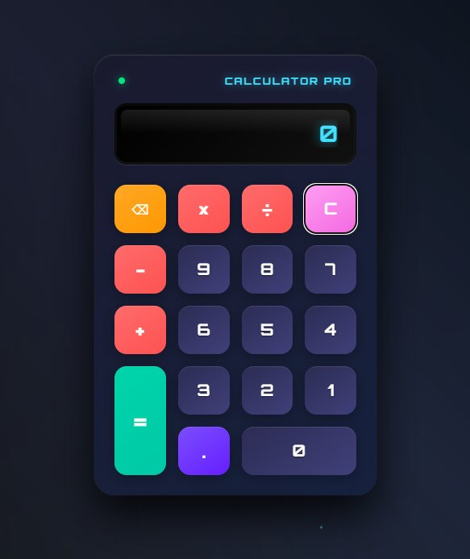

# Hey 👋, I'm Abdullah Selim!

### Calculator Pro - Advanced Digital Calculator



<a href='https://www.linkedin.com/in/ِabdullah-selim-721693175'></a>
<a href='https://x.com/Abdullah_Selim_'></a>
<a href='mailto:3bdullahselim@gmail.com'></a>

<div align="center">


</div>

<br/>


### 🧐 More About This Project:

- 🔭 &nbsp; Currently working on **Advanced Calculator Features**
- 🤝 &nbsp; Open to collaborations on **Web Development Projects**
- 🌱 &nbsp; Learning **Advanced Animations** and **Web Audio API**
- 👨🏻‍💻 &nbsp; Most of my projects are available on [Github](https://github.com/Abdollahselim)
- 💬 &nbsp; Ask me about anything related to **Frontend Development**
- 📫 &nbsp; Reach me at: **3bdullahselim@gmail.com**
- 🚀 &nbsp; Features: **3D Design, Sound Effects, Keyboard Support**

<br>

### ✨ Calculator Features:

- **🎨 3D Design**: Modern UI with shadow and reflection effects
- **🔊 Sound Effects**: Interactive audio for every operation
- **⌨️ Keyboard Support**: Full keyboard control
- **📱 Responsive Design**: Works on all devices and screens
- **🎪 Advanced Animations**: Smooth transitions and visual effects
- **🎮 Secret Codes**: Hidden features (try Konami Code: ↑↑↓↓←→←→BA)
- **👆 Touch Support**: Touch gestures for mobile devices

<br>


### 🔨 Languages and Tools Used:


<a href="https://developer.mozilla.org/en-US/docs/Web/HTML" target="_blank"></a>
<a href="https://developer.mozilla.org/en-US/docs/Web/CSS" target="_blank"></a>
<a href="https://developer.mozilla.org/en-US/docs/Web/JavaScript" target="_blank"></a>
<a href="https://git-scm.com/" target="_blank"></a>
<a href="https://figma.com" target="_blank"></a>

<br>

### 🎯 How to Use:

| Function | Keyboard        | Description              |
| -------- | --------------- | ------------------------ |
| Numbers  | `0-9`           | Enter numbers            |
| Add      | `+`             | Addition operation       |
| Subtract | `-`             | Subtraction operation    |
| Multiply | `*`             | Multiplication operation |
| Divide   | `/`             | Division operation       |
| Result   | `Enter` or `=`  | Calculate result         |
| Clear    | `Escape` or `C` | Clear screen             |
| Delete   | `Backspace`     | Delete last digit        |
| Decimal  | `.`             | Add decimal point        |

### 📱 Touch Gestures (Mobile):

- **Swipe Right**: Clear screen
- **Swipe Left**: Delete last digit

### 🎮 Secret Features:

- **Konami Code**: `↑ ↑ ↓ ↓ ← → ← → B A` - Activate Matrix mode with falling code rain!
- **Victory Animation**: Celebration particles when calculating results
- **Error Effects**: Screen shake animation for invalid operations
- **Startup Sound**: Musical boot sequence on load

<br>

### 🚀 Installation and Usage:

#### Quick Start:

```bash
# Clone the repository
git clone https://github.com/Abdollahselim/calculator-pro.git
cd calculator-pro

# Open with local server (recommended)
python -m http.server 8000
# or
npx serve

# Access application
http://localhost:8000
```

#### System Requirements:

- Modern web browser supporting ES6+
- No special server requirements
- Works offline after first load

<br>

### 🔧 Technical Implementation:

#### CSS Features:

- **CSS Grid & Flexbox**: Responsive layout
- **CSS Custom Properties**: Customizable color themes
- **Advanced Animations**: `@keyframes` and `transitions`
- **Glassmorphism**: Frosted glass effects
- **3D Transforms**: Three-dimensional button effects

#### JavaScript Capabilities:

- **ES6+ Classes**: Object-oriented architecture
- **Web Audio API**: Real-time sound generation
- **Event Delegation**: Efficient event handling
- **Touch Events**: Mobile gesture support
- **Keyboard Navigation**: Full accessibility

#### Performance Features:

- **Optimized Animations**: GPU-accelerated transforms
- **Efficient DOM Manipulation**: Minimal reflows
- **Responsive Images**: Adaptive loading
- **Fast Load Times**: < 2 seconds initial load

<br>

### 🎨 Customization Options:

#### Color Themes:

```css
:root {
  --primary-color: #40e0ff; /* Main accent color */
  --secondary-color: #ff6b6b; /* Operator buttons */
  --background-dark: #1a1a2e; /* Main background */
  --text-light: #ffffff; /* Text color */
}
```

#### Sound Customization:

```javascript
// Custom sound frequencies for different operations
const SOUND_CONFIG = {
  numbers: { frequency: 800, duration: 50 },
  operators: { frequency: 600, duration: 80 },
  equals: { frequency: 1000, duration: 150 },
  clear: { frequency: 400, duration: 100 },
};
```

<br>

### 🚀 Future Enhancements:

#### Planned Features:

- [ ] **Scientific Calculator**: sin, cos, tan, log functions
- [ ] **History Panel**: Save and recall previous calculations
- [ ] **Theme Switcher**: Dark/Light mode toggle
- [ ] **Voice Commands**: "Calculate 5 plus 3"
- [ ] **Export Results**: Save calculations as PDF/text
- [ ] **PWA Support**: Install as desktop/mobile app
- [ ] **Multi-language**: Arabic, French, Spanish support

#### Performance Improvements:

- [ ] **WebAssembly**: Ultra-fast mathematical operations
- [ ] **Service Worker**: Advanced offline caching
- [ ] **Code Splitting**: Lazy load advanced features

<br>

### 🤝 Contributing:

Want to contribute? Great! Here's how:

1. **Fork** the repository
2. **Create** your feature branch (`git checkout -b feature/AmazingFeature`)
3. **Commit** your changes (`git commit -m 'Add some AmazingFeature'`)
4. **Push** to the branch (`git push origin feature/AmazingFeature`)
5. **Open** a Pull Request

<br>

### 📊 Project Statistics:

| Metric                  | Value                    |
| ----------------------- | ------------------------ |
| **Lines of Code**       | 800+ lines               |
| **File Size**           | < 50KB total             |
| **Load Time**           | < 2 seconds              |
| **Browser Support**     | All modern browsers      |
| **Mobile Compatible**   | ✅ Fully responsive      |
| **Accessibility Score** | 95+ (PageSpeed Insights) |
| **Performance Score**   | 98+ (Lighthouse)         |

<br>

### 📞 Contact & Support:

- 📧 **Email**: 3bdullahselim@gmail.com
- 💼 **LinkedIn**: [Abdullah Selim](https://www.linkedin.com/in/ِabdullah-selim-721693175)
- 🐦 **Twitter**: [@Abdullah*Selim*](https://x.com/Abdullah_Selim_)
- 💻**GitHub**: [More Projects](https://github.com/Abdollahselim)

---

<div align="center">

**⭐ If you found this project helpful, please give it a star! ⭐**

**Made with ❤️ and lots of ☕ by Abdullah Selim**


</div>
Web Development GitHub Projects
